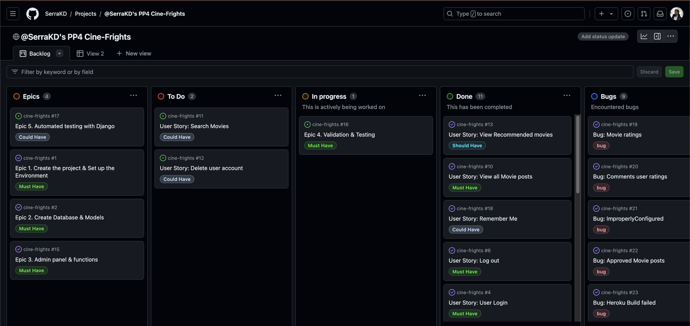

# ***Cine Frights***

- **Description :** **Cine Frights** Is a horror movie review blog created for Portfolio Project 4. This website includes the latest horror movies with various popular movie pages ratings, website's ratings, a chance to create a user account, comment on movies to share users' opinions, join to website newsletter, and recommend a movie to be featured on the website.
- **Project goal :** To create a platform for horror movie lovers to review the latest horror movies, and engage with other users by commenting and sharing opinions about movies.
- **Audience :**  The target audience is adults who like horror movies and are in search of new movie recommendations.
- **Live website :** [https://cine-frights-ed31240ece67.herokuapp.com/](https://cine-frights-ed31240ece67.herokuapp.com/)
- **Github Page :** [https://github.com/SerraKD/cine-frights](https://github.com/SerraKD/cine-frights)
- **Github Projects :**[https://github.com/users/SerraKD/projects/4](https://github.com/users/SerraKD/projects/4)

---

## User Experience (UX)

### **Site Goals**

The goal of the Cine-Frights site is to attract users who like horror movies and are on the lookout for what to watch next. Even though there are multiple platforms for movie reviews, this site focuses on one genre that is quite popular and not much shown.

- Easy to navigate, user-friendly website structure.
- Design that suits to horror theme.
- A place to let users share their opinions about movies.
- A place where users can find multiple ratings regarding movie posts.
- Option the read movie summary, genre and release that all in one page.
- A place where users can interact further by recommending a movie to the site to be featured.
- A newsletter option that keeps users updated about the newest horror flicks.

### **Target Audiance**

The target audience is users looking for new horror movies, seeing multiple ratings on one platform, seeing other people's opinions about the movies, and sharing their opinions in one place. 

- Individuals who are interested in horror movies.
- Individuals who are looking for a new movie to watch.
- Individuals who want to share their opinion about the latest horror movie they watched.
- Individuals who are interested in other like-minded individuals' opinions about horror movies.

### **Epics**

As the site developer, I used Epics as the main frame to build the site and keep the work ordered.

- **[Epic 1. Create the project & Set up the Environment](https://github.com/users/SerraKD/projects/4/views/1?pane=issue&itemId=71533834)** &check;
> Epic Description : Set up the project repository and manage the Heroku deployment.

- **[Epic 2. Create Database & Models](https://github.com/users/SerraKD/projects/4/views/1?pane=issue&itemId=71536163)** &check;
> Epic Description : configure database, manage environment variables, create models.

- **[Epic 3. Admin Panel & Functions](https://github.com/users/SerraKD/projects/4/views/1?pane=issue&itemId=71563124)** &check;
> Epic Description : Site admins competence & tasks.

- **[Epic 4. Validation & Testing](https://github.com/users/SerraKD/projects/4/views/1?pane=issue&itemId=71564008)** &check;
> Epic Description : All testing and validation required for the project.

- **[Epic 5. Automated testing with Django](https://github.com/users/SerraKD/projects/4/views/1?pane=issue&itemId=71564953)**
> Epic Description: Automated testing to check projects functionality.

### **User stories**

I created 12 user stories with MoSCoW prioritization technique. Every user story includes the acceptance criteria.

- **[1.User Story: User Account registration](https://github.com/SerraKD/cine-frights/issues/3)** &check;

> As a site user I can create an account so that i can use the site as logged in user .

> Acceptance Criteria
> 1. With a username & password user can register an account.
> 2. After creation user can log in.
> 3. Logged in user can view and create a comment.

- **[2.User Story: User Login](https://github.com/SerraKD/cine-frights/issues/4)** &check;

> As a site user I can login into my account so that i can write a comment on a movie post and suggest movies to the site.

> Acceptance Criteria
> 1. I can log in into account using my user name and password with log in link.

- **[3.User Story: View the details of movie posts](https://github.com/SerraKD/cine-frights/issues/5)** &check;

> As a Site User, I can click on a post so that I can read the movie details, view ratings and comments.

> Acceptance Criteria
> 1. When a movie post title is clicked on movie name, info, ratings and user comment is seen.

- **[4.User Story: Log out](https://github.com/SerraKD/cine-frights/issues/6)** &check;

> As a site user I can log out of my account.

> Acceptance Criteria
> 1. Any logged in user has the functionality to log out.

- **[5.User Story: Comment on a movie post](https://github.com/SerraKD/cine-frights/issues/7)** &check;

> As a site user I can write comments so that i can engage with other users and share my opinion about movies.

> Acceptance Criteria
> 1. Comments has to be approved my admin before other users view.
> 2. Users can read, update and delete their comments.

- **[6.User Story: Change or delete a comment](https://github.com/SerraKD/cine-frights/issues/9)** &check;

> As a Site User I can change or delete my comment on a movie post.

> Acceptance Criteria
> 1. A logged in user can change &/or delete their comment.

- **[7.User Story: View all Movie posts](https://github.com/SerraKD/cine-frights/issues/10)** &check;

>  As a site user I can view all movies so that i can choose which movie post i want to see more detailed.

> Acceptance Criteria
> 1. All movie posts should be listed with their poster.
> 2. When a user opens movies page all posts can be seen.
> 3. Page pagination required if there is multiple posts.

- **[8.User Story: Search Movies](https://github.com/SerraKD/cine-frights/issues/11)** &cross;

> As a site user i can search movie names so that i can find specific movie post i am interested in.

> Acceptance Criteria
> 1. Search bar should be at the top of the home page. 

- **[9.User Story: Delete user account](https://github.com/SerraKD/cine-frights/issues/12)** &cross;

> As a user I can delete my account if i want to.

> Acceptance Criteria
> 1. When i go to my account page i can delete my account.

- **[10.User Story: View Recommended movies](https://github.com/SerraKD/cine-frights/issues/13)** &check;

> As a site user I can view recommended movies on a slide at the home page.

> Acceptance Criteria
> 1. The slides must include movie posters and names.
> 2. When clicked on, the slide picture should take user to the linked movie post.

- **[11.User Story: Recommend a movie](https://github.com/SerraKD/cine-frights/issues/14)** &check;

> As a logged in user i would like to recommend a movie to the site admin for it to be featured.

> Acceptance Criteria
> 1. Logged in users can fill out a form to recommend a movie.

- **[12.User Story: Subscribe to Newsletter](https://github.com/SerraKD/cine-frights/issues/28)** &check;

> As a user, I can subscribe to the newsletter to stay updated about the newest movies.

> Acceptance Criteria
> 1. I can subscribe to the newsletter easily as a logged in user by providing my email address.
> 2. A confirmation message is shown if the subscription is completed successfully.

---
> **[Kanban Board @SerraKD's PP4 Cine-Frights](https://github.com/users/SerraKD/projects/4/views/1)**
---

## Design

### Wire-frames

In the planning stage, I used Balsamiq wireframes to create the basic layout of the website. Views of the pages change depending on if the user is signed in. The final design evolved more to fit to horror theme.

| Page  | Wireframe |
| :----: | :----: |
| Home |  |
| Home Signed in |  |
| Films |  |
| Films Signed in |  |
| Movie Detail |  |
| Movie Detail Signed in |  |
| Sign In |  |
| Login |  |

## Features
## Validation, Testing & Bugs
## Deployment
## Technologies & Frameworks
## Credits
## Acknowledgments