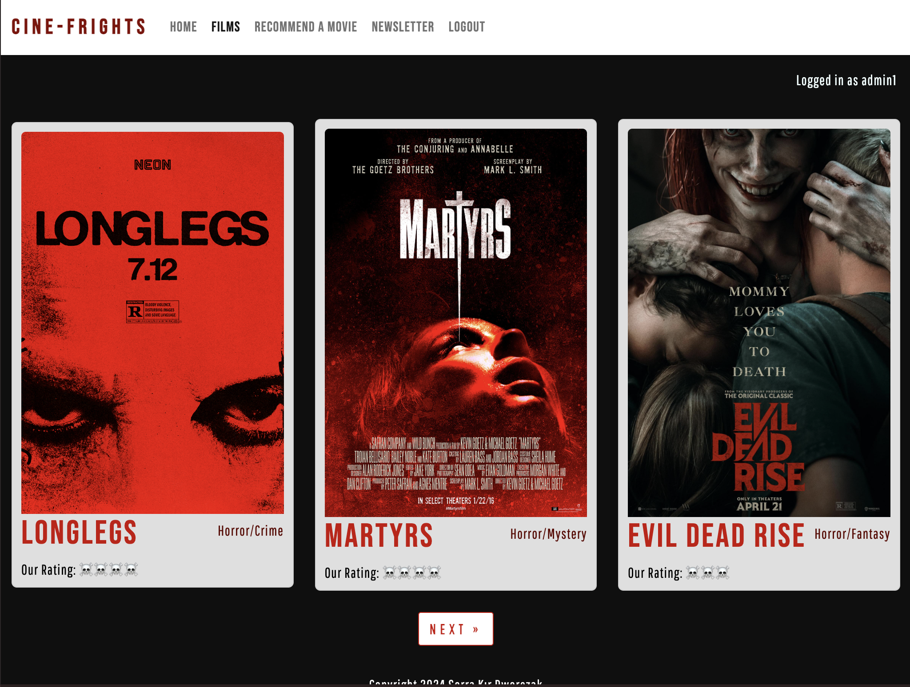
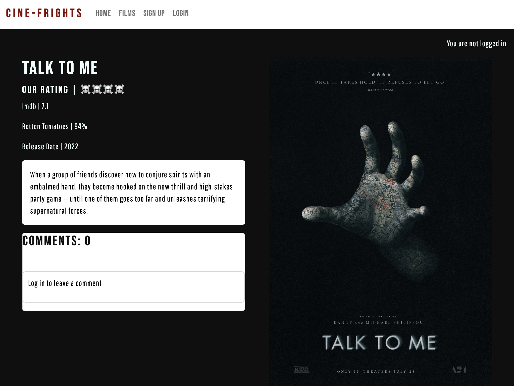
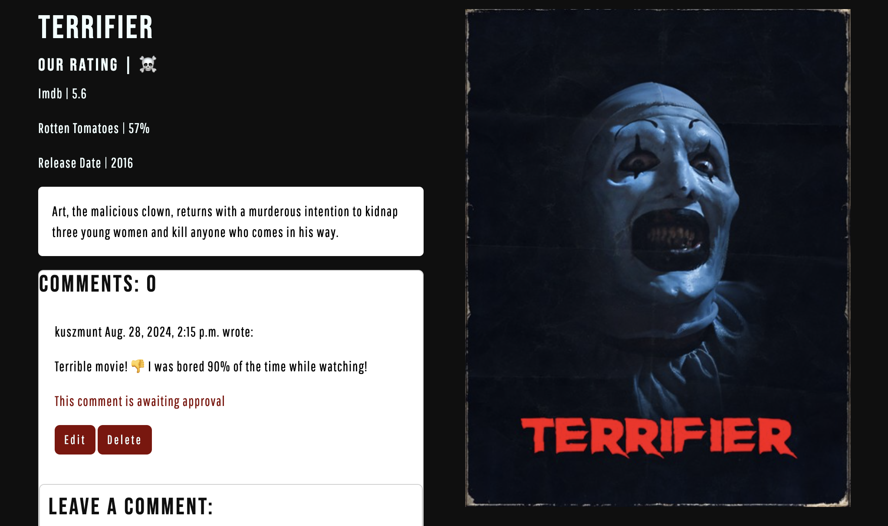
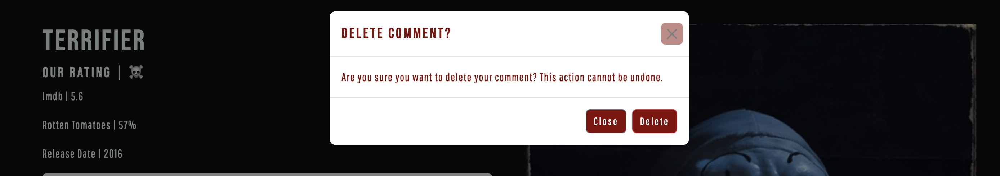
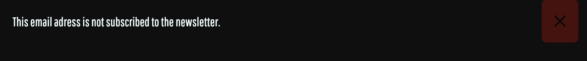

# ***Cine-Frights***

- **Description :** **Cine Frights** Is a horror movie review blog created for Portfolio Project 4. This website includes the latest horror movies with various popular movie pages ratings, website's ratings, a chance to create a user account, comment on movies to share users' opinions, join to website newsletter, and recommend a movie to be featured on the website.
- **Project goal :** To create a platform for horror movie lovers to review the latest horror movies, and engage with other users by commenting and sharing opinions about movies.
- **Audience :**  The target audience is adults who like horror movies and are in search of new movie recommendations.
- **Live website :** [https://cine-frights-ed31240ece67.herokuapp.com/](https://cine-frights-ed31240ece67.herokuapp.com/)
- **Github Page :** [https://github.com/SerraKD/cine-frights](https://github.com/SerraKD/cine-frights)
- **Github Projects :**[https://github.com/users/SerraKD/projects/4](https://github.com/users/SerraKD/projects/4)

---
# **Table of contents**

1. [***Cine-Frights***](#cine-frights)
2. [**User Experience (UX)**](#user-experience-ux)
   - [**Site Goals**](#site-goals)
   - [**Target Audiance**](#target-audiance)
   - [**Epics**](#epics)
   - [**User stories**](#user-stories)
3. [**Design**](#design)
   - [**Colour Scheme**](#colour-scheme)
   - [**Typography**](#typography)
   - [**Wire-frames**](#wire-frames)
   - [**Data Models**](#data-models)
4. [**Features**](#features)
   - [**General features**](#general-features)
      - [**Navigation bar**](#navigation-bar)
      - [**Footer**](#footer)
      - [**404 Page**](#404-page)
   - [**Home Page**](#home-page)
   - [**Films Page**](#films-page)
   - [**Movie Details**](#movie-details)
   - [**Sign Up Page**](#sign-up-page)
   - [**Login Page**](#login-page)
   - [**Log out page**](#log-out-page)
   - [**Recommend A Movie Page**](#recommend-a-movie-page)
   - [**Newsletter Page**](#newsletter-page)
5. [**Validation, Testing & Bugs**](#validation-testing--bugs)
   - [**Validation**](https://github.com/SerraKD/cine-frights/blob/main/VALIDATION.md)
      1. [**HTML Validation**](https://github.com/SerraKD/cine-frights/blob/main/VALIDATION.md#html-validation)
          - [**Home Page**](https://github.com/SerraKD/cine-frights/blob/main/VALIDATION.md#home-page)
          - [ **Films Page**](https://github.com/SerraKD/cine-frights/blob/main/VALIDATION.md#films-page)
          - [**Movie Detail Page**](https://github.com/SerraKD/cine-frights/blob/main/VALIDATION.md#movie-detail-page)
          - [**Recommend a Movie Page**](https://github.com/SerraKD/cine-frights/blob/main/VALIDATION.md#recommend-a-movie-page)
          - [**Newsletter Page**](https://github.com/SerraKD/cine-frights/blob/main/VALIDATION.md#newsletter-page)
          - [**Log out Page**](https://github.com/SerraKD/cine-frights/blob/main/VALIDATION.md#log-out-page)
          - [**Sign Up Page**](https://github.com/SerraKD/cine-frights/blob/main/VALIDATION.md#sign-up-page)
          - [**Login Page**](https://github.com/SerraKD/cine-frights/blob/main/VALIDATION.md#login-page)
      2. [**PEP8 Validation**](https://github.com/SerraKD/cine-frights/blob/main/VALIDATION.md#pep8-validation)
      3. [**JS Validation**](https://github.com/SerraKD/cine-frights/blob/main/VALIDATION.md#js-validation)
      4. [**CSS Validation**](https://github.com/SerraKD/cine-frights/blob/main/VALIDATION.md#css-validation)
      5. [**Lighthouse**](https://github.com/SerraKD/cine-frights/blob/main/VALIDATION.md#lighthouse)
   - [**Testing**](https://github.com/SerraKD/cine-frights/blob/main/TESTING.md#testing)
      1. [**Manual Testing**](https://github.com/SerraKD/cine-frights/blob/main/TESTING.md#manual-testing)
         - [**Navigation bar**](https://github.com/SerraKD/cine-frights/blob/main/TESTING.md#navigation-bar)
         - [**Home Page**](https://github.com/SerraKD/cine-frights/blob/main/TESTING.md#home-page)
         - [**Signup Page**](https://github.com/SerraKD/cine-frights/blob/main/TESTING.md#signup-page)
         - [**Films Page**](https://github.com/SerraKD/cine-frights/blob/main/TESTING.md#films-page)
         - [**Movie Detail Page** & JS Testing(Comments)](https://github.com/SerraKD/cine-frights/blob/main/TESTING.md#movie-detail-page--js-testingcomments)
         - [**Login Page**](https://github.com/SerraKD/cine-frights/blob/main/TESTING.md#login-page)
         - [**Logout Page**](https://github.com/SerraKD/cine-frights/blob/main/TESTING.md#logout-page)
         - [**Recommend a movie Page**](https://github.com/SerraKD/cine-frights/blob/main/TESTING.md#recommend-a-movie-page)
         - [**Newsletter Page**](https://github.com/SerraKD/cine-frights/blob/main/TESTING.md#newsletter-page)
   - [**Bugs**](https://github.com/SerraKD/cine-frights/blob/main/BUGS.md#bugs)
      1. [**Fixed Bugs**](https://github.com/SerraKD/cine-frights/blob/main/BUGS.md#fixed-bugs)
      2. [**Unfixed bugs**](https://github.com/SerraKD/cine-frights/blob/main/BUGS.md#unfixed-bugs)
6. [**Deployment**](#deployment)
   - [**CI Database Maker**](#ci-database-maker)
   - [**Cloudinary**](#cloudinary)
   - [**Environment & Settings**](#environment--settings)
   - [**Deploying to Heroku**](#deploying-to-heroku)
7. [**Local Deployment**](#local-deployment)
8. [**Technologies & Frameworks**](#technologies--frameworks)
   - [**Main Technologies**](#main-technologies)
   - [**Frameworks, Libraries & Programs Used**](#frameworks-libraries--programs-used)
9. [**Credits**](#credits)
   - [**Image Credits**](#image-credits)
10. [**Acknowledgments**](#acknowledgments)

## **User Experience (UX)**

### **Site Goals**

The goal of the Cine-Frights site is to attract users who like horror movies and are on the lookout for what to watch next. Even though there are multiple platforms for movie reviews, this site focuses on one genre that is quite popular and not much shown.

- Easy to navigate, user-friendly website structure.
- Design that suits to horror theme.
- A place to let users share their opinions about movies.
- A place where users can find multiple ratings regarding movie posts.
- Option the read movie summary, genre and release that all in one page.
- A place where users can interact further by recommending a movie to the site to be featured.
- A newsletter option that keeps users updated about the newest horror flicks.

### **Target Audiance**

The target audience is users looking for new horror movies, seeing multiple ratings on one platform, seeing other people's opinions about the movies, and sharing their opinions in one place. 

- Individuals who are interested in horror movies.
- Individuals who are looking for a new movie to watch.
- Individuals who want to share their opinion about the latest horror movie they watched.
- Individuals who are interested in other like-minded individuals' opinions about horror movies.

### **Epics**

As the site developer, I used Epics as the main frame to build the site and keep the work ordered.

- **[Epic 1. Create the project & Set up the Environment](https://github.com/users/SerraKD/projects/4/views/1?pane=issue&itemId=71533834)** https://github.com/SerraKD/cine-frights/labels/Must%20Have &check;
> Epic Description : Set up the project repository and manage the Heroku deployment.

- **[Epic 2. Create Database & Models](https://github.com/users/SerraKD/projects/4/views/1?pane=issue&itemId=71536163)** https://github.com/SerraKD/cine-frights/labels/Must%20Have &check;
> Epic Description : configure database, manage environment variables, create models.

- **[Epic 3. Admin Panel & Functions](https://github.com/users/SerraKD/projects/4/views/1?pane=issue&itemId=71563124)** https://github.com/SerraKD/cine-frights/labels/Must%20Have &check;
> Epic Description : Site admins competence & tasks.

- **[Epic 4. Validation & Testing](https://github.com/users/SerraKD/projects/4/views/1?pane=issue&itemId=71564008)** https://github.com/SerraKD/cine-frights/labels/Must%20Have &check;
> Epic Description : All testing and validation required for the project.

- **[Epic 5. Automated testing with Django](https://github.com/users/SerraKD/projects/4/views/1?pane=issue&itemId=71564953)** https://github.com/SerraKD/cine-frights/labels/Could%20Have
> Epic Description: Automated testing to check projects functionality.

I tried to built few tests in movies app and films app for forms and views, whenever i run the tests i am getting below error.

**"Found 1 test(s).
Creating test database for alias 'default'...
Traceback (most recent call last):

django.db.utils.OperationalError: near "None": syntax error"**

> I believe the error is caused by movies.0004_alter_movie_our_rating migration. Need to delete existing migrations and make migrations again.

> Explanation of migration **'0004_alter_movie_our_rating'** : I added emoji picker widget to add emojis for movie ratings as admin, but i decided to not use the widget because i could add emojis to text field without any extra widgets.

At this point of the project, the deployed site works without any issues, and i don't have any errors in the workspace. I don't want to alter the migrations because it shows the development process clearly and i don't want to cause any unexpected errors.

> **I really wanted to include basic automated testing to improve my skills, so i will be adding it to the project after submission and getting the results.**

### **User stories**

I created 12 user stories with MoSCoW prioritization technique. Every user story includes the acceptance criteria.

- **[1.User Story: User Account registration](https://github.com/SerraKD/cine-frights/issues/3)** https://github.com/SerraKD/cine-frights/labels/Must%20Have &check;

> As a site user I can create an account so that i can use the site as logged in user .

> Acceptance Criteria
> 1. With a username & password user can register an account.
> 2. After creation user can log in.
> 3. Logged in user can view and create a comment.

- **[2.User Story: User Login](https://github.com/SerraKD/cine-frights/issues/4)** https://github.com/SerraKD/cine-frights/labels/Must%20Have &check;

> As a site user I can login into my account so that i can write a comment on a movie post and suggest movies to the site.

> Acceptance Criteria
> 1. I can log in into account using my user name and password with log in link.

- **[3.User Story: View the details of movie posts](https://github.com/SerraKD/cine-frights/issues/5)** https://github.com/SerraKD/cine-frights/labels/Must%20Have &check;

> As a Site User, I can click on a post so that I can read the movie details, view ratings and comments.

> Acceptance Criteria
> 1. When a movie post title is clicked on movie name, info, ratings and user comment is seen.

- **[4.User Story: Log out](https://github.com/SerraKD/cine-frights/issues/6)** https://github.com/SerraKD/cine-frights/labels/Must%20Have  &check;

> As a site user I can log out of my account.

> Acceptance Criteria
> 1. Any logged in user has the functionality to log out.

- **[5.User Story: Comment on a movie post](https://github.com/SerraKD/cine-frights/issues/7)** https://github.com/SerraKD/cine-frights/labels/Must%20Have &check;

> As a site user I can write comments so that i can engage with other users and share my opinion about movies.

> Acceptance Criteria
> 1. Comments has to be approved my admin before other users view.
> 2. Users can read, update and delete their comments.

- **[6.User Story: Change or delete a comment](https://github.com/SerraKD/cine-frights/issues/9)** https://github.com/SerraKD/cine-frights/labels/Must%20Have &check;

> As a Site User I can change or delete my comment on a movie post.

> Acceptance Criteria
> 1. A logged in user can change &/or delete their comment.

- **[7.User Story: View all Movie posts](https://github.com/SerraKD/cine-frights/issues/10)** https://github.com/SerraKD/cine-frights/labels/Must%20Have &check;

>  As a site user I can view all movies so that i can choose which movie post i want to see more detailed.

> Acceptance Criteria
> 1. All movie posts should be listed with their poster.
> 2. When a user opens movies page all posts can be seen.
> 3. Page pagination required if there is multiple posts. 

- **[8.User Story: Search Movies](https://github.com/SerraKD/cine-frights/issues/11)** https://github.com/SerraKD/cine-frights/labels/Could%20Have &cross; https://github.com/SerraKD/cine-frights/labels/Wont%20Have

> As a site user i can search movie names so that i can find specific movie post i am interested in.

> Acceptance Criteria
> 1. Search bar should be at the top of the home page. 

- **[9.User Story: Delete user account](https://github.com/SerraKD/cine-frights/issues/12)** https://github.com/SerraKD/cine-frights/labels/Could%20Have &cross; https://github.com/SerraKD/cine-frights/labels/Wont%20Have

> As a user I can delete my account if i want to.

> Acceptance Criteria
> 1. When i go to my account page i can delete my account. 

- **[10.User Story: View Recommended movies](https://github.com/SerraKD/cine-frights/issues/13)** https://github.com/SerraKD/cine-frights/labels/Should%20Have &check;

> As a site user I can view recommended movies on a slide at the home page.

> Acceptance Criteria
> 1. The slides must include movie posters and names.
> 2. When clicked on, the slide picture should take user to the linked movie post.

- **[11.User Story: Recommend a movie](https://github.com/SerraKD/cine-frights/issues/14)** https://github.com/SerraKD/cine-frights/labels/Could%20Have &check;

> As a logged in user i would like to recommend a movie to the site admin for it to be featured.

> Acceptance Criteria
> 1. Logged in users can fill out a form to recommend a movie.

- **[12.User Story: Subscribe to Newsletter](https://github.com/SerraKD/cine-frights/issues/28)** https://github.com/SerraKD/cine-frights/labels/Could%20Have &check;

> As a user, I can subscribe to the newsletter to stay updated about the newest movies.

> Acceptance Criteria
> 1. I can subscribe to the newsletter easily as a logged in user by providing my email address.
> 2. A confirmation message is shown if the subscription is completed successfully.

---
> **[Kanban Board @SerraKD's PP4 Cine-Frights](https://github.com/users/SerraKD/projects/4/views/1)**
---

## **Design**

### **Colour Scheme**

 I kept the color scheme minimalistic and fitting to the horror theme of the site. I realized that many horror movie posters use these colors.

### **Typography**

I selected Pathway Gothic One and Bebas Neue fonts from Google fonts. The dramatic feel of Bebas Neue font fits the site headings and movie titles perfectly.

### **Wire-frames**

In the planning stage, I used Balsamiq wireframes to create the basic layout of the website. Views of the pages change depending on if the user is signed in. The final design evolved more to fit to horror theme.

| Page  | Wireframe |
| :----: | :----: |
| Home |  |
| Home Signed in |  |
| Films |  |
| Films Signed in |  |
| Movie Detail |  |
| Movie Detail Signed in |  |
| Sign In |  |
| Login |  |

### **Data Models**

**Films**

Data models generated with [Django-extensions](https://django-extensions.readthedocs.io/en/latest/) & [Graphviz](https://graphviz.org/).

**Movies**

## **Features**

### **General features**

General features include features that are found on every page such as the navigation bar and footer.

#### **Navigation bar**

| Nav-bar| Image |
| :----: | :----: |
| Mobile |  |
| Mobile Dropdown |  |
| Mobile Logged in user|  |
| Desktop |  |
| Desktop Logged in user |  |

---

#### **Footer**

---

> #### **404 Page**

---

### **Home Page**

The home page view includes one carousel slide to show the latest movies on the site. The content view of the page does not change whether the user is logged in or out, but the pages such as Newsletter and Recommend a Movie at the nav bar are only visible to logged-in users.

- There is an informative message at the top right corner of the page letting users if they are logged in.

| Home Page | Image |
| :----: | :----: |
| Mobile |  |
| Desktop |  |
| Desktop Logged in user |  |

- When clicked, carousel image headings take the user to related movie posts and they have a hover effect.

- **Image heading and genre is only visible for tablets and larger screens.**

---

### **Films Page**

Films page includes three movie posts per page and page pagination. Movie card shows movie poster, movie title, movie genre and website ratings. When clicked on a movie heading or genre, it takes the user to movie post details.

- When clicked, movie titles take the user to related movie posts and they have a hover effect.

| Films Page | Image |
| :----: | :----: |
| Mobile |  |
| Mobile Pagination |  |
| Desktop |  |

---

### **Movie Details**

Movie detail page includes movie title, site rating, IMDb and Rotten Tomatoes ratings, movie release date, movie summary, movie poster, user comments and add a comment sections.

| Movie Details | Image |
| :----: | :----: |
| Mobile |  |
| Desktop |  |
| Desktop |  |
| Desktop |  |

 **Comments**

> - To add a comment users have to be signed in.
> - Only comment author can edit or delete their comments.

> - **After submitting or editing a comment user gets informative feedback.**

> 
> 

> - **If deleting a comment is selected, a warning modal pops up to inform the user.**

> 

> - Movie comments are only visible after approval of admin.
> - Unapproved comments are only visible to their authors, change or deletion is possible.
> - Movie comments are visible to logged in and out users.

### **Sign Up Page**

The signup page includes a form for the user to signup to the website.
Username and password is mandatory and email is optional.

| Sign Up | Image |
| :----: | :----: |
| Mobile |  |
| Desktop |  |

### **Login Page**

The login page includes a form for the user to sign in with their username and password.

| Login | Image |
| :----: | :----: |
| Mobile |  |
| Desktop |  |

### **Log out page**

The logout page includes a simple form for the user to logout.

| Log out | Image |
| :----: | :----: |
| Mobile |  |
| Desktop |  |

### **Recommend A Movie Page**

Recommend a movie page includes a form for users to recommend a movie for the website to be featured. All fields are mandatory to successfully send the form.

| Recommend A Movie | Image |
| :----: | :----: |
| Mobile |  |
| Desktop |  |

> **If the form is correct, an informative text is shown to the user that their request is received.**

> 

### **Newsletter Page**

The newsletter page includes a subscribe and unsubscribe form to the site's Newsletter.

| Newsletter | Image |
| :----: | :----: |
| Mobile |  |
| Desktop |  |

> **If the user already subscribed with the given email address, an informative message is shown to the user that the subscription failed.**
> 

> **If the form is correct, an informative text is shown to the user that their request is received.**
> 

> **If the provided email is not already subscribed, an informative text is shown to the user that this email is not subscribed.**
> 

> **If the form is incorrect, an informative text is shown to the user that their unsubscription failed.**
> 

## **Validation, Testing & Bugs**

I documented validation, testing, and bugs in all separate files. Links to the relative files are located below.

### **Validation**

> **[VALIDATION.md](VALIDATION.md)**

### **Testing**

> **[TESTING.md](TESTING.md)**

### **Bugs**

> **[BUGS.md](BUGS.md)**

## **Deployment**

### **CI Database Maker**

- Input your email to [CI Database Maker](https://dbs.ci-dbs.net/)
- Go to your email and open the latest mail you recieved from Code Institute.
- Click on the on the provided link to manage databases. 
- Copy database URL provided you in selected database **info**.
- Update your settings.py in your project directory.

### **Cloudinary**

- Go to [Cloudinary](https://console.cloudinary.com/) and register a new account.
- Login to Cloudinary with your account credentials.
- Navigate to Add a new environment.
- Confirm your selection.
- In your dashboard,under Product Environment, click on Go to API Keys.
- Copy Cloudinary URL in format **cloudinary://<your_api_key>:<your_api_secret>**
- Update settings.py in the your project directory.

### **Environment & Settings**

- In your IDE open your env.py file or create one in the main directory if it hasn't been created.
- Add the DATABASE_URL value and a SECRET_KEY value to the env.py file.
**[create the secret key in env.py, fetch it in settings.py](https://github.com/SerraKD/cine-frights/commit/167033169c42dbc91271837a6595273cb989546f)**
- Open the settings.py file and import the env.py file and the DATABASE_URL and SECRETKEY file paths.
- Install Django and add to requirements.txt.
- Create your project.
- Add the STATIC files settings.
- Create a file called **Procfile** in the main directory,
- Add Cloudinary URL to env.py for cloud-based image storage.
- Add Cloudinary to INSTALLED APPS.
- Add your IDE workspace and Heroku to ALLOWED_HOSTS.
- Make migrations and migrate.
- Before you add, commit & push your files to GitHub, ensure **DEBUG** is set to **False** in your settings.py file.

### **Deploying to Heroku**

- Log in or create an account on Heroku.com. Click 'New' and then 'Create New App'.
- Give your project a unique name, select a region, and click 'Create App'.
- Connect your Heroku project to your GitHub repository. Under deployment, you can choose GitHub, select the appropriate one, and - select 'Connect'.
- When you are connected, go to the Settings tab and click on 'Reveal Config Vars'. Add the environment key & value variables used in your env.py file **(CLOUDINARY_URL, DATABASE_URL & SECRET_KEY)**.
- Next, add **'DISABLE_COLLECTSTATIC'** and add '1' if this is for disabling to prevent errors, or 0 if the app is in a state where errors will not be generated.
- Click on Buildpack further down and click Add Buildpack.
- Go to the Deploy section, click on Github for the deployment method, and confirm.
- Search for your repository name and click connect.
- At the bottom of the deploy section, make sure you are connected to the main branch and then click Deploy Branch.
- Now you can view your live site.

## **Local Deployment**

**Fork**:

1. Log in to Github and go to projects' repository.
2. On the top right side of the page, click on _fork_ button.

**Clone**:

1. Log in to Github and go to projects' repository.
2. On the top of the file lists, click on _Code_ button.
3. Whether you want to use HTTPS, SSH key or Github CLI select it, and then click on copy.
4. Open the terminal, type **git clone** and paste the URL copied.
5. Press enter and local clone is now created.

## **Technologies & Frameworks**

### **Main Technologies**

- HTML - templates language of the project 
- CSS - styling of the project with external CSS file
- Python - BackEnd programming language of the project
- JavaScript - for functionality.

### **Frameworks, Libraries & Programs Used**

- [Django](https://docs.djangoproject.com/) Python based framework for backend development.
- [Bootstrap v.5.2.3](https://getbootstrap.com/docs/5.2/) styling framework used for the project.
- [CI Database Maker](https://dbs.ci-dbs.net/)  Postgres database to store data.
- [Cloudinary](https://console.cloudinary.com/) - used to store static files.
- [Heroku](https://id.heroku.com/login)  to deploy the project.
- [GitHub](https://github.com/)  for version control and kanban board.
- [Gitpod](https://www.gitpod.io/)  cloud IDE to deploy workspace environment to Github.
- [Google Fonts](https://fonts.google.com/) to import fonts used on the site.
- [Balsamiq](https://balsamiq.com/) to create Wireframes.
- [V3C HTML](https://validator.w3.org/) used for HTML validator testing.
- [V3C CSS](https://jigsaw.w3.org/css-validator/) used for CSS validator testing.
- [JShint](https://jshint.com/) used for JavaScript testing.
- [CI Python Linter](https://pep8ci.herokuapp.com/) used for Python validator testing.
- [Dev Tools](https://developer.chrome.com/docs/devtools/) used throughout the project for testing, troubleshooting, and styling.
- [Grammarly](https://app.grammarly.com/) To check the grammar of all text content.
- [Django-extensions](https://django-extensions.readthedocs.io/en/latest/) & [Graphviz](https://graphviz.org/) Used  to create database scheme.

## **Credits**

- [favicon](https://favicon.io/) for site logo
- [Am I responsive?](https://ui.dev/amiresponsive) for responsive mockup.
- [Adobe Color Wheel](https://color.adobe.com/) for color scheme
- Code Institute Slack Channel
- Code Institute Tutor Support
- Markdown labels [https://github.com/isaacs/github/issues/305](https://github.com/isaacs/github/issues/305#issuecomment-308790044)

 > **Below documents and sites were used as study and reference material.**

 - https://docs.djangoproject.com/en/4.2/ref/models/fields/#model-field-types
 - https://developer.mozilla.org/en-US/docs/Learn/Forms/Sending_and_retrieving_form_data
 - https://getbootstrap.com/docs/5.2/layout/utilities/
 - https://getbootstrap.com/docs/5.2/examples/grid/#containers
 - https://stackoverflow.com/questions/53594745/what-is-the-use-of-cleaned-data-in-django
 - [CI I Think Therefore I Blog](https://learn.codeinstitute.net/) walkthrough project to help and assist with setup and coding.
 - https://docs.python.org/3/library/exceptions.html
 - https://www.w3schools.com/python/python_try_except.asp
 - https://docs.djangoproject.com/en/5.1/ref/templates/builtins/#slice
 - https://docs.djangoproject.com/en/5.1/ref/templates/builtins/

### **Image Credits**

- [default image | Photo by Dmitry Demidov: https://www.pexels.com/photo/bobbin-on-heap-of-film-3921045/s](https://www.pexels.com/photo/bobbin-on-heap-of-film-3921045/)

Click to View movie poster credits

- https://images.app.goo.gl/syrCJZXRvUD3TkE7A
- https://images.app.goo.gl/U3ryWUDco1Y6iZys6
- https://images.app.goo.gl/RwXNJaPHtyfkWV1r7
- https://images.app.goo.gl/8GFH9YTMELj1xC4e9
- https://www.filmweb.pl/film/Terrifier-2011-692670/posters
- https://images.app.goo.gl/CYuQGkvnK7sPfxoy7
- https://www.imdb.com/title/tt4972582/mediaviewer/rm1913600000/?ref_=tt_ov_i
- https://images.app.goo.gl/g9Xqhd124AHAqhYK9
- https://images.app.goo.gl/7X2J43dzSeG98hEYA
- https://images.app.goo.gl/yrUmrDneD1u1nsKM6
- https://images.app.goo.gl/ktf6JmwERbWoNfF69
- https://images.app.goo.gl/3qBw4pu2UQosNBVi9
- https://encrypted-tbn1.gstatic.com/images?q=tbn:ANd9GcSPkv49y0UYywLik-CVtV5TnAl5KXKwf9W0nqOrw7HCl-pqow5k
- https://images.app.goo.gl/6tEm4TTEdV14AdVg8
- https://images.app.goo.gl/c3mNhZDPHJc3QxQd6
- https://images.app.goo.gl/D8Gn2iQikTyJkPA66
- https://images.app.goo.gl/WM453Peq485jGfTJA
- https://images.app.goo.gl/yUwnvUZnXGH5Xumn8
- https://images.app.goo.gl/KrA2qZstDoBALP3d7
- https://images.app.goo.gl/s81iKDuGpayFYLzNA

## **Acknowledgments**

- I am deeply grateful to my Mentor [Rory Patrick Sheridan](https://github.com/Ri-Dearg), for his invaluable guidance, support, and great tips.

- Special thanks to everyone from CI Tutor Assistance for helping me to fight off the roadblocks I stumbled upon while working on this project.

[Back to top](https://github.com/SerraKD/cine-frights#cine-frights)