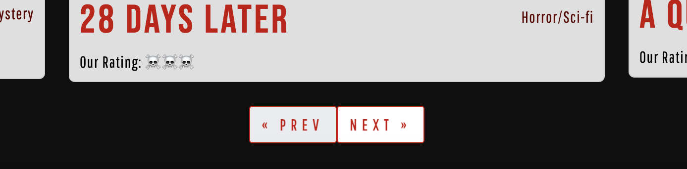

# **Testing**

## **Manual Testing**

> **All Testings are done both on mobile and desktop devices.**
---
### **Navigation bar** 

| Category | Feature | Expected Behaviour | Testing Method | Actual Behaviour | Result |
| :------- | :------ | :----------------- | :--------------- | :------------- | :----- |
| **Navigation bar** | Logo | Take user to home page when clicked | Clicked on logo | Takes to home page | **PASS &check;** |
| **Navigation bar** | Home link | Take user to home page when clicked | Clicked on home link | Takes to home page | **PASS &check;** |
| **Navigation bar** | Films link | Take user to films page when clicked | Clicked on films link | Takes to films page  | **PASS &check;** |
| **Navigation bar** | Signup link | Take user to Signup form when clicked | Clicked on Signup link | Takes to Signup page | **PASS &check;** |
| **Navigation bar** | Login link | Take user to Login form when clicked | Clicked on Login link | Takes to Login page | **PASS &check;** |
| **Navigation bar** | Recommend a movie link | Take user to Recommendation form when clicked | Clicked on Recommendation link | Takes to Recommend a movie page | **PASS &check;** |
| **Navigation bar** | Newsletter link | Take user to Newsletter form when clicked | Clicked on Newsletter link | Takes to Newsletter page | **PASS &check;** |

- Navigation bar is fully functional on mobile devices.

---

### **Home Page** 

| Category | Feature | Expected Behaviour | Testing Method | Actual Behaviour | Result |
| :------- | :------ | :----------------- | :--------------- | :------------- | :----- |
| **Home Page** | Movie Carousel | The slide function should work without distortion, showing the latest movie posts. | Went to home page | The carousel slide works without any errors or image distortions. | **PASS &check;** |
| **Home Page**  | Carousel Movie Title & Genre link  | Take the user to the relevant movie post.(desktop only) | Clicked on title & genre | Takes to relevant movie post. | **PASS &check;** |
| **Home Page**  | Carousel Indicators | Control slides post to view.  | Clicked on indicators. | Changes which movie post is shown. | **PASS &check;** |

---

### **Signup Page** 

| Category | Feature | Expected Behaviour | Testing Method | Actual Behaviour | Result |
| :------- | :------ | :----------------- | :--------------- | :------------- | :----- |
| **Signup Page** | Username | Warn if username is already taken | Tried to signup with the superusername. | Warns that username is taken. | **PASS &check;** |
| **Signup Page** | Password | Warn if password doesnt contain at least 8 characters. | Tried to signup with password shorter than 8 characters. | Warns that password is too short. | **PASS &check;** |
| **Signup Page** | Password | Warn if password is a commonly used password. | Tried to signup with password "12345678" | Warns that password is commonly used. | **PASS &check;** |
| **Signup Page** | Password | Warn of password is entirely numeric. | Tried to signup with password "12345678"  | Warns that password is entirely numeric. | **PASS &check;** |
| **Signup Page** | Email    | Accept form submitton without a provided email. | Created an account without providing email adress. | Accepted the signup form without provided email adress. | **PASS &check;** |
| **Signup Page** | Signup form | Accept form submitton if if user data provided is suiting to above requirements. | Created a new account. | Accepted signup form. | **PASS &check;** |

---

### **Films Page** 

| Category | Feature | Expected Behaviour | Testing Method | Actual Behaviour | Result |
| :------- | :------ | :----------------- | :--------------- | :------------- | :----- |
| **Films Page** | Pagination | Users should be taken to the next page or the previous page. | Clicked both buttons. | Takes to next and previous page. | **PASS &check;** |
| **Films Page** | Movie title & genre links | Users should be taken to the movie details when movie title is clicked. | Clicked on mvie titles. | Takes to relevant movies detail page. | **PASS &check;** |

---

### **Movie Detail Page** 

| Category | Feature | Expected Behaviour | Testing Method | Actual Behaviour | Result |
| :------- | :------ | :----------------- | :--------------- | :------------- | :----- |
| **Movie Detail Page** | Add comment | Any signed in user can add a comment to movie posts. | Went to movie detail page and added a comment asn signed in user. | Comment submitted successfuly, informative message is shown. | **PASS &check;** |
| **Movie Detail Page**| Edit comment | Any signed in user can edit their comments on movie posts. | Clicked on edit button to comment i submitted in the previous step, and updated the comment.  | Comment updated successfuly, informative message is shown. | **PASS &check;** |
| **Movie Detail Page** | Delete comment | Any signed in user can delete their comments on movie posts. | Clicked on delete button to comment i updated in the previous step, and deleted the comment. | A delete comment confirmation modal appears, Comment deleted successfuly,  | **PASS &check;** |
| **Movie Detail Page**| View comments | Any signed in & out user can view admin approved comments on movie posts. | Went to movie details page as signed in and out user. | If any, comments are visible. | **PASS &check;** |
| **Movie Detail Page** | View movie poster | Any signed in & out user can view movie poster on medium and large devices. | Went to movie details page as signed in and out user. | Movie poster is visible in medium and large devices.  | **PASS &check;** |

---

###  **Login Page** 

| Category | Feature | Expected Behaviour | Testing Method | Actual Behaviour | Result |
| :------- | :------ | :----------------- | :--------------- | :------------- | :----- |
| **Login Page** | 	Signing In | The username and password has to match with a previously registered account. | Tried signing with previously created mock account. | Signed in succesfully. | **PASS &check;** |
| **Login Page** |  Signing In | If username and password has to match with a previously registered account, show warning. | Tried signing in with an non existent account. | Warned that given credentials are not correct. Sign in failed. | **PASS &check;** |

---

### **Logout Page** 

| Category | Feature | Expected Behaviour | Testing Method | Actual Behaviour | Result |
| :------- | :------ | :----------------- | :--------------- | :------------- | :----- |
| **Logout Page** | Logging out | Any signed in user can logout without any errors, after signing out information is given to user. | Signed out with superuser and user accounts. | Succesfully signed out as user & superuser. | **PASS &check;** |

---

### **Recommend a movie Page**

| Category | Feature | Expected Behaviour | Testing Method | Actual Behaviour | Result |
| :------- | :------ | :----------------- | :--------------- | :------------- | :----- |
| **Recommend a movie Page** | Movie Recommendation Form | Any signed in user can submit a movie recommendation form. | Submitted a recomendation as signed in user. | Form succesfuly submitted. | **PASS &check;** |
| **Recommend a movie Page** | Form fields | All required form fields has to be filled to submit the form. | Tried submitting the form with one empty field and multiple empty fields. | Form cannot be submitted with empty fields. | **PASS &check;** |

---

### **Newsletter Page**

| Category | Feature | Expected Behaviour | Testing Method | Actual Behaviour | Result |
| :------- | :------ | :----------------- | :--------------- | :------------- | :----- |
| **Newsletter Page** | Newsletter Form Subscribe | Any signed in user can subscribe to the sites newsletter. | Submitted subscription form with test email as logged in user. | Subscription form is succesfuly submitted, informative message is shown. | **PASS &check;** |
| **Newsletter Page** | Newsletter Form Subscribe | Users cannot subscribe to newsletter using same email adress more than once. | Entered test@email.com adress twice, first subscribe submission was success and second one failed with an info message. | Trying to subscribe with previously given email adress fails. | **PASS &check;** |
| **Newsletter Page** | Newsletter Form Unsubscribe | Any signed in user can unsubscribe to the sites newsletter if they previously subscribed. | Submitted unsubscription form with test email as logged in user. | Unsubscription form is succesfuly submitted, informative message is shown. | **PASS &check;** |
| **Newsletter Page** | Newsletter Form Unsubscribe | Users cannot unsubscribe to newsletter using same email adress more than once. | Entered test@email.com adress twice, first unsubscription submission was success and second one failed with an info message.  | Trying to unsubscribe with previously given email adress fails. | **PASS &check;** |
| **Newsletter Page** | Newsletter Form Unsubscribe | Users cannot unsubscribe to newsletter if the given email adress does not have a subscription. | Entered a mock email to unsubscription form. | Unsubscription failed, an informative message is shown. | **PASS &check;** |

 
---
