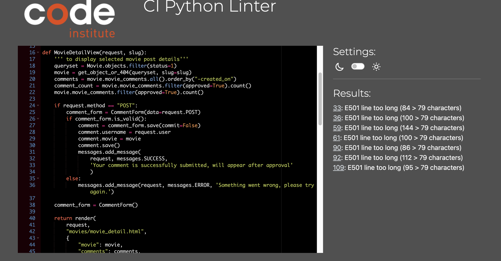
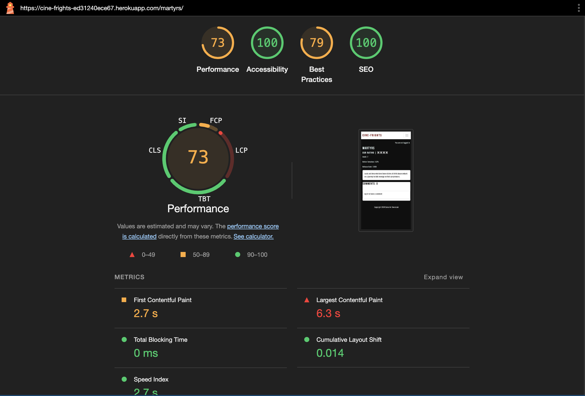
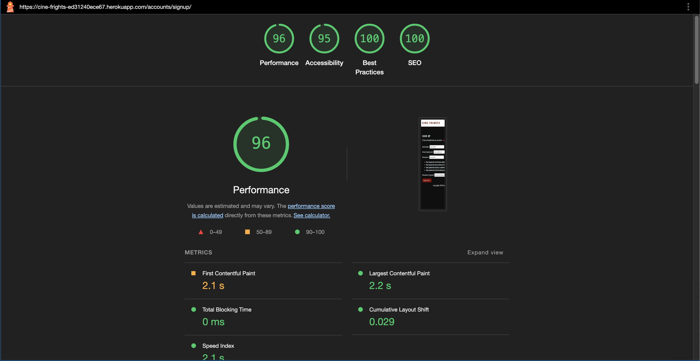

# **Validation**

# **Table of contents**

1. [**HTML Validation**](#html-validation)
    - [**Home Page**](#home-page)
    - [ **Films Page**](#films-page)
    - [**Recommend a Movie Page**](#recommend-a-movie-page)
    - [**Newsletter Page**](#newsletter-page)
    - [**Log out Page**](#log-out-page)
    - [**Sign Up Page**](#sign-up-page)
    - [**Login Page**](#login-page)
2. [**PEP8 Validation**](#pep8-validation)
3. [**JS Validation**](#js-validation)
4. [**CSS Validation**](#css-validation)
5. [**Lighthouse**](#lighthouse)

## **HTML Validation**

 - [W3C HTML Validator](https://validator.w3.org/) - is used to validate each pages source code.

### **Home Page**

> **Errors & Fix**
1. Error: Duplicate ID nav-item. | **Fix: Removed the redundant nav-item id's from list elements in base.html**
2. Error: Duplicate ID carousel-caption. | **Fix: Removed the redundant carousel-caption id's and added as class in index.html**
3. Error: Duplicate ID carousel-title. | **Fix: Removed the redundant carousel-title id's  and added as class in index.html**

> **Result**
| Document checking completed. No errors or warnings to show. &check;
---

### **Films Page**

> **Errors & Fix**
1. Error: Duplicate ID card-title.| **Fix: Removed the redundant card-title id's from post link in films.html**
2. Error: Duplicate ID movie-summary| **Fix: Removed the redundant movie-summary id's from post link in films.html**

> **Result**
| Document checking completed. No errors or warnings to show. &check;
---

### **Movie Detail Page**

> **Errors & Fix**
1. Error: Attribute comment_is ID not allowed on element button. | **Fix: Added data attibute to comment id in movie_detail.html**

> **Result**
| Document checking completed. No errors or warnings to show. &check;
---

### **Recommend a Movie Page**

> **Errors & Fix**
**No errors found.**

> **Result**
| Document checking completed. No errors or warnings to show. &check;
---

### **Newsletter Page**

> **Errors & Fix**
1. Error: Duplicate ID div_id_email.

> Error description: This error is caused by the crispy subscription form I created. Because for subscribing and unsubscribing the server is using the same form, it's automatically creating the above error. Unfortunately, I couldn't fix this issue.

> **Result**
| Error remains &cross;
---

### **Log out Page**

> **Errors & Fix**
**No errors found.**

> **Result**
| Document checking completed. No errors or warnings to show. &check;
---

### **Sign Up Page**

> **Errors & Fix**
1. Error:  End tag p implied, but there were open elements. 
2. Error: Unclosed element span. 
3. Error: No p element in scope but a p end tag seen. 

> Error description: This error is caused by Django's sign-up form. The part of the code that I wrote does not return any errors.

> **Result**
| Error remains &cross;
---

### **Login Page**

> **Errors & Fix**
**No errors found.** 

> **Result**
| Document checking completed. No errors or warnings to show. &check;
---

## **PEP8 Validation**

- [CI Python Linter](https://pep8ci.herokuapp.com/) used for all .py files.

All the errors besides the ones specified below was about indentation, trailing whitespace and blank lines and all of them are fixed.

| Directory    | File    | Result    |
| :------: | :--------: | :--------: |
| films  | admin.py  | PASS |
| films | urls.py    | PASS  |
| films | views.py   | PASS |
| films | apps.py   | PASS  |
| films | models.py  | PASS |
| films  | forms.py  | PASS |
| movies | admin.py  | PASS |
| movies | urls.py   | PASS |
| movies | views.py  | PASS  |
| movies | apps.py   | PASS   |
| movies | models.py   | PASS |
| movies  | forms.py   | PASS   |
| cinefrights | asgi.py    | PASS |
| cinefrights  | settings.py | FAIL |
| cinefrights  | urls.py     | PASS   |
| cinefrights  | wsgi.py     | PASS  |

> After fixing the [Newsletter Unsubscribe Bug](https://github.com/SerraKD/cine-frights/issues/29) in films/views.py i ran PEP8 validation again.

---
> **All below files' Fail Reason was Line too long**

**settings.py**

**movies/models.py**

**movies/urls.py**

**movies/views.py**

---

**Fix**

> **I broke down all long lines in below files and did PEP8 validation again**

**movies/models.py**

**movies/urls.py**

**movies/views.py**

---

## **JS Validation**

- [JSHint](https://jshint.com/) is used for custom Js file validation.

**comments.js**

## **CSS Validation**

- [W3C CSS Validator](https://jigsaw.w3.org/css-validator/) is used for custom css file validation.

**style.css**

## **Lighthouse**

 - [Chrome Lighthouse](https://developer.chrome.com/docs/lighthouse/overview) is used in incognito mode to test the performance, accessibility, best practices, and SEO of the site.

**Home Page**

 

**Films Page**

 

**Movie Detail Page**

 

**Sign up Page**

 

**Login Page**

 

**Newsletter Page**

 

**Recommend a movie Page**

**Logout Page**

**[Go back to README.md](https://github.com/SerraKD/cine-frights#cine-frights)**